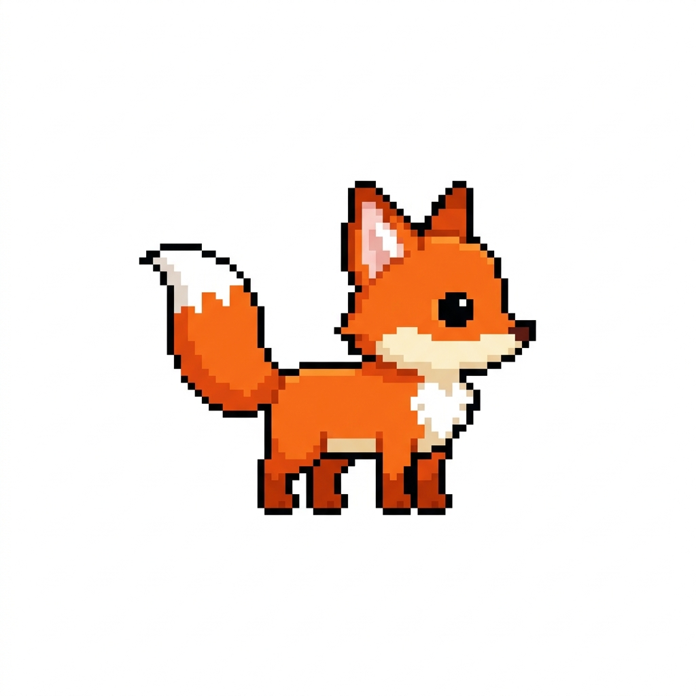
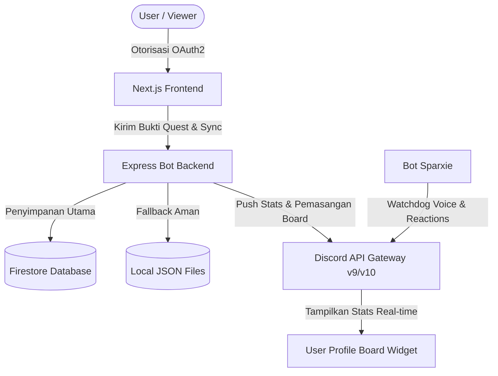

# 🎪 CrunchyVerse: Interactive Theatrical Stage & Quest System

<p align="center">
  
</p>

<p align="center">
  <strong>Panggung teater virtual interaktif premium yang tersinkronisasi langsung secara real-time dengan Bot Discord Sparxie.</strong>
</p>

<p align="center">
  
  
  
  
  
</p>

---

## 🎭 Sekilas Tentang CrunchyVerse

**CrunchyVerse** adalah platform teater panggung virtual interaktif modern berestetika premium yang menghubungkan interaksi komunitas Discord secara langsung ke dalam website. User dapat masuk menggunakan otorisasi **Discord OAuth**, menikmati transisi visual cuaca panggung (pagi, sore, malam), melihat live leaderboard panggung, dan mengikuti tantangan interaktif di **Tirai Tantangan**.

Seluruh data statistik user (level, jam voice channel, streak, dan kekayaan teater/CV$) akan terhubung dan ter-render secara native langsung di profil Discord user melalui fitur **Discord Profile Widgets v2 (Board)** resmi!

---

## ✨ Fitur-Fitur Utama

* **🪐 Panggung Teater Virtual Dinamis**: Menggunakan *Gradient-Sky Graphics Engine* yang berubah warna secara dinamis berdasarkan jam lokal (Pagi ☀️, Senja 🌅, Malam 🌌 lengkap dengan efek kerlip bintang pixel art).
* **🤖 Bot Discord Sparxie**: Bertugas melakukan sinkronisasi status voice, memantau live stream TikTok/YouTube, memvalidasi role kasta teater, dan mengelola pengerjaan quest secara real-time.
* **🔮 Discord Profile Widget v2 (Native Board)**: Integrasi termutakhir yang memungkinkan statistik teater CrunchyVerse user (Level, Voice Hours, Streak, CV$) tampil elegan dan interaktif di tab **Board** profil Discord asli mereka.
* **🃏 Tirai Tantangan (Quest Game)**: Mini-game kartu quest di mana pengguna dapat mengklaim quest, mengunggah bukti penyelesaian, dan diproses oleh admin/volunteer langsung dari panel panggung.
* **👑 Sistem Keamanan & Kasta**: Integrasi login 100% menggunakan Discord OAuth. Fitur-fitur sensitif dan panel admin terkunci otomatis khusus untuk role `Volunteer Theater`, `Ketua Kerupuk`, dan `Ketua Keripik`.
* **💾 Database Fail-Safe**: Menggunakan Firestore sebagai database utama dengan *timeout handling* 1.5 detik yang otomatis fallback ke penyimpanan JSON lokal jika Firebase mengalami kendala, menjamin website 24/7 anti-crash.

---

## 🏗️ Arsitektur Sistem



---

## 📂 Struktur Direktori

```
CrunchyVerse/
├── discord-bot/               # 🤖 Server Backend Express & Bot Discord (Render)
│   ├── database/              # Penyimpanan data JSON lokal (user_decks, submissions, dll)
│   ├── src/
│   │   ├── index.js           # Entrypoint Express server & logic bot
│   │   ├── logic/             # Modular sub-modules (routes, websocket, sync, firebase)
│   │   └── utils/             # Helper utilities (db, voice, discord, etc)
│   ├── package.json
│   └── reset-sim.js           # Script reset testing deck/score
├── src/                       # 🎨 Frontend Web Next.js (Vercel)
│   ├── app/
│   │   ├── layout.tsx
│   │   ├── page.tsx           # Halaman utama panggung teater
│   │   └── globals.css        # Tema teatrikal kustom HSL
│   ├── components/
│   │   ├── TiraiCountdown.tsx # Countdown gate premium untuk Frame 7
│   │   ├── LoginModal.tsx     # Form login khusus Discord OAuth
│   │   ├── QuestGame.tsx      # Quest board (Tirai Tantangan)
│   │   └── ... (komponen lain)
│   └── lib/
│       └── firebase.ts        # Inisialisasi Firebase & Firestore
├── public/                    # Aset statis & gambar teater
└── package.json               # Package Root script
```

---

## 🚀 Panduan Teknis & Deployment

<details>
<summary>📦 1. Inisialisasi & Push ke GitHub</summary>

Untuk mengunggah kode lokal ke repositori GitHub `https://github.com/AnataSim/CV.git`, jalankan perintah berikut di terminal:

```bash
# Inisialisasi git jika belum dilakukan
git init

# Tambahkan remote repository
git remote add origin https://github.com/AnataSim/CV.git

# Buat branch utama ke main
git branch -M main

# Add & Commit semua file
git add .
git commit -m "feat: setup deployment vercel & render, countdown timer, dan login discord only"

# Push ke GitHub
git push -u origin main
```
</details>

<details>
<summary>📡 2. Deployment Backend & Bot Discord (Render)</summary>

Karena bot memerlukan koneksi persistent WebSocket, taruh backend di **Render** sebagai **Web Service**:

1. Masuk ke [Dashboard Render](https://dashboard.render.com/) dan buat **New Web Service**.
2. Hubungkan repositori GitHub Anda (`AnataSim/CV`).
3. Set detail service sebagai berikut:
   * **Name**: `crunchyverse-backend`
   * **Environment**: `Node`
   * **Region**: `Singapore`
   * **Branch**: `main`
   * **Root Directory**: `discord-bot` *(Sangat Penting!)*
   * **Build Command**: `npm install`
   * **Start Command**: `npm start`
4. Tambahkan **Environment Variables** di menu **Environment**:
   * `PORT`: `3001`
   * `DISCORD_TOKEN`: *(Token bot Discord)*
   * `DISCORD_CLIENT_ID`: *(Client ID)*
   * `DISCORD_CLIENT_SECRET`: *(Client Secret)*
   * `DISCORD_REDIRECT_URI`: `https://<nama-web-service>.onrender.com/api/oauth/callback`
   * `TIKTOK_USERNAME`: `jobetmaritoas`
   * *(Opsional - Firebase)* `FIREBASE_PROJECT_ID`, `FIREBASE_CLIENT_EMAIL`, `FIREBASE_PRIVATE_KEY`
5. Klik **Create Web Service**.
</details>

<details>
<summary>🎨 3. Deployment Frontend (Vercel)</summary>

Frontend Next.js di-deploy ke **Vercel**:

1. Masuk ke [Vercel](https://vercel.com/) dan buat project baru (**Add New Project**).
2. Hubungkan repositori GitHub Anda (`AnataSim/CV`).
3. Konfigurasikan proyek sebagai berikut:
   * **Framework Preset**: `Next.js`
   * **Root Directory**: `./`
4. Tambahkan **Environment Variables**:
   * `NEXT_PUBLIC_BACKEND_URL`: `https://crunchyverse-backend.onrender.com` *(URL backend Render)*
   * *(Opsional - Firebase Client)* `NEXT_PUBLIC_FIREBASE_API_KEY`, `NEXT_PUBLIC_FIREBASE_PROJECT_ID`, dll.
5. Klik **Deploy**.
</details>

<details>
<summary>⏰ 4. Konfigurasi Cron Job (Stay 24/7)</summary>

Agar Sparxie Bot tetap menyala 24/7 secara konstan pada tier gratis Render, pasang Cron Job eksternal:

1. Daftar akun di [cron-job.org](https://cron-job.org/) atau [UptimeRobot](https://uptimerobot.com/).
2. Buat Cron Job baru dengan konfigurasi:
   * **Title**: `CrunchyVerse Backend Keep-Alive`
   * **Address (URL)**: `https://crunchyverse-backend.onrender.com/api/stats`
   * **Request Method**: `GET`
   * **Schedule**: Setiap **10 menit** (`*/10 * * * *`)
3. Simpan. Ping rutin ini akan mencegah Render menidurkan server Anda.
</details>
